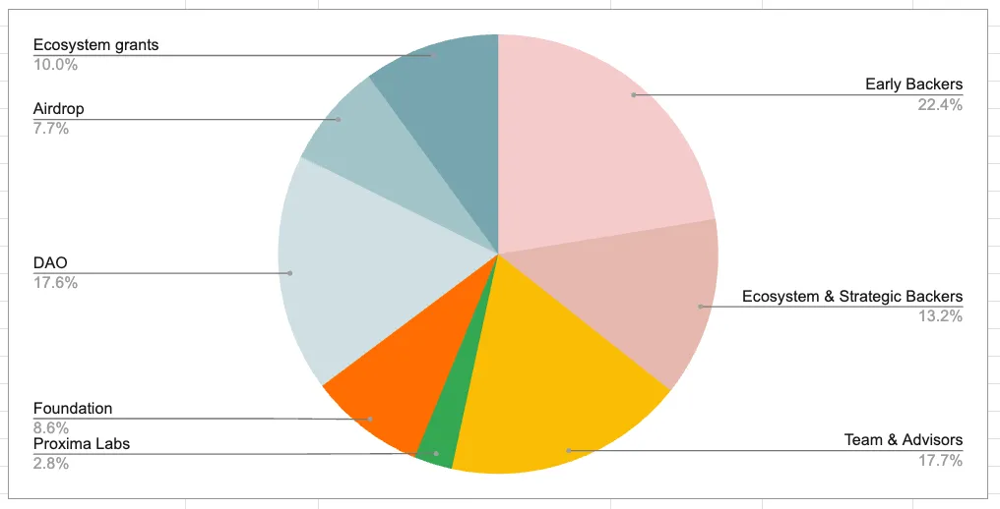
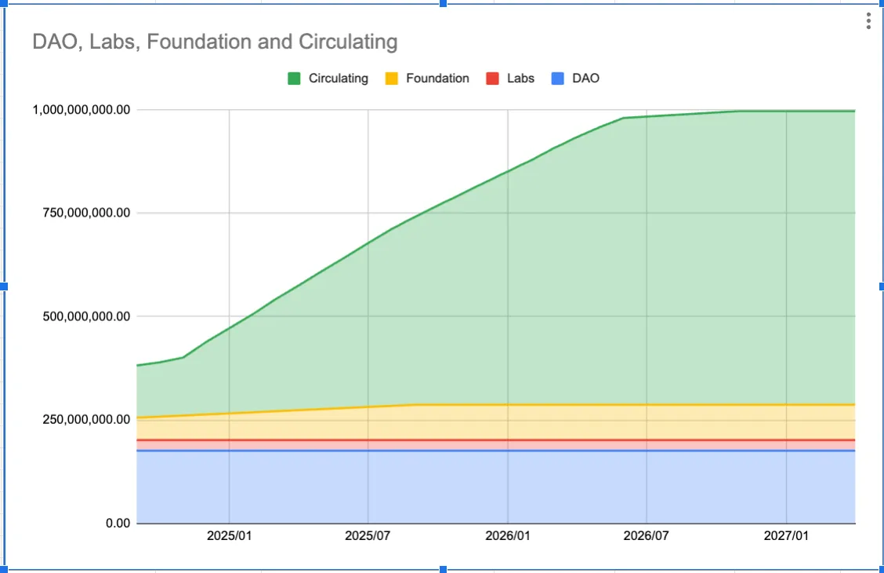

---
layout:
  title:
    visible: true
  description:
    visible: false
  tableOfContents:
    visible: true
  outline:
    visible: true
  pagination:
    visible: true
---

# Token Distribution & Circulating Supply



### Token Supply and Distribution

The total supply of CLEAR is capped at 1,000,000,000 tokens.

Everclear structured its token distribution to prioritize long-term growth in the ecosystem. Crypto projects often require years of weathering various aspects of market cycles, and the distribution allocation strikes a balance between short-term incentives and long-term sustainability.

Everclear (prev Connext) allocated 11% of its tokens (107M) to the public during its initial distribution in September 2023. This portion was intended to reward the community of active participants prior to the distribution event.

The 22.4% for early backers, consisting primarily of investors, alongside 13.2% for ecosystem and strategic backers, aims to create a diverse stakeholder base that supports the development of the protocol as it grows from its infancy stage into a sustainable, self-supporting ecosystem.

The 11.9% allocated between Foundation and Labs is held to maintain the development of the protocol and operational needs to maintain the protocol’s infrastructure over time.

The 15.5% held by DAO is designed to ensure a wide base of ecosystem participants and foster decentralized growth of contributors to the ecosystem — often managing grants to a variety of parties committed to expanding Everclear’s adoption.

### **Distribution Overview:**

| **Category**                  | **% of total supply** | **Number of NEXT** |
| ----------------------------- | --------------------- | ------------------ |
| Early Backers                 | 22.43%                | 224.34M            |
| Ecosystem & Strategic Backers | 13.23%                | 132.32M            |
| Team & Advisors               | 17.72%                | 177.22M            |
| Proxima Labs                  | 2.81%                 | 28.12M             |
| Foundation                    | 8.56%                 | 85.56M             |
| DAO                           | 17.56%                | 175.57M            |
| Airdrop                       | 7.67%                 | 76.72M             |
| Ecosystem grants              | 10.02%                | 100.15M            |
| **Total supply**              |                       | **1,000M**         |

<figure><figcaption></figcaption></figure>

### How is Circulating Supply Calculated?

The circulating supply, as of Jan 8, 2025, stands at 20.75% of the total token supply.

| Allocated to                  | Tokens Allocated | In circulation at Jan 8 2025 |
| ----------------------------- | ---------------- | ---------------------------- |
| Early Backers                 | 224.33M          | 23.61M                       |
| Ecosystem & Strategic Backers | 132.31M          | 13.93M                       |
| Team & Advisors               | 177.21M          | 22.16M                       |
| Proxima Labs                  | 28.11M           | not circulating              |
| Foundation                    | 85.56M           | not circulating              |
| DAO                           | 175.57M          | not circulating              |
| Airdrop                       | 76.7M            | 65.5M                        |
| Ecosystem grants              | 100.1M           | 82.33M                       |
| **Totals**                    | **1B**           | **207.54M**                  |

### Unlock Schedule Overview

<figure><figcaption>
Disclaimer: This is an illustrative graph and is not intended to serve as an exact representation of future token distribution.
</figcaption></figure>

The total blended unlock rate across the entire token allocation base is 3.0% over a period of 18 months. Accordingly, approximately 56% of the currently locked supply is expected to be unlocked within the same 18-month timeframe, with 53% comprising team and backers’ tokens and 3% allocated to other parties.

Each category of token holders is subject to varying lock-up terms and schedules based on various factors, including differing degrees of contribution, timing of contribution, milestones, and legal considerations.

| **Token Holder Category**                                                   | **Lockup Period**          | **Release Type** | **Release Period** |
| --------------------------------------------------------------------------- | -------------------------- | ---------------- | ------------------ |
| Early Backers                                                               | 15 months                  | Linear           | 18 months          |
| Ecosystem & Strategic Backers                                               | 15 months                  | Linear           | 18 months          |
| Team & Advisors                                                             | 15 months                  | Linear           | 18 months          |
| Proxima Labs                                                                | Unlocked (Non-Circulating) | N/A              | N/A                |
| Foundation                                                                  | Unlocked (Non-Circulating) | N/A              | N/A                |
| DAO                                                                         | Unlocked (Non-Circulating) | N/A              | N/A                |
| Contributors, community leaders, DAO grant recipients (<7% of total supply) | 12 months                  | Linear           | 12 months          |

### How are Foundation and Labs tokens utilized?

The Foundation generally uses its tokens to incentivize the growth of the protocol, typically through business development/strategic partnership type arrangements, broader community building initiatives, and, most importantly, aligning long-term incentives of employees/contributors to Everclear Foundation. These token grants are typically set up with lock-up schedules, which is why they're excluded from circulating supply.

Proxima Labs is primarily responsible for the technical development of the protocol. As such, Labs employees are often rewarded with long-term token grants, subject to a lock-up period.

## Data Definitions

### Circulating Supply

We define **circulating supply** as the best approximation of the number of tokens that are actively circulating in the market and held by the general public.

In accordance with best practices, we exclude the following categories:

1. **Locked Tokens**: Tokens allocated to Team, Backers, and grants/airdrops that remain subject to lockup periods.
2. **DAO-Allocated Tokens**: Although technically unlocked, these tokens are earmarked for ecosystem grants and development, which may involve subsequent lockup conditions.
3. **Foundation and Proxima Labs Allocations**: Due to legal and operational restrictions, these tokens are primarily reserved for initiatives subject to lockups, such as:
   1. Employee incentives
   2. OTC fundraising
   3. Partnerships



