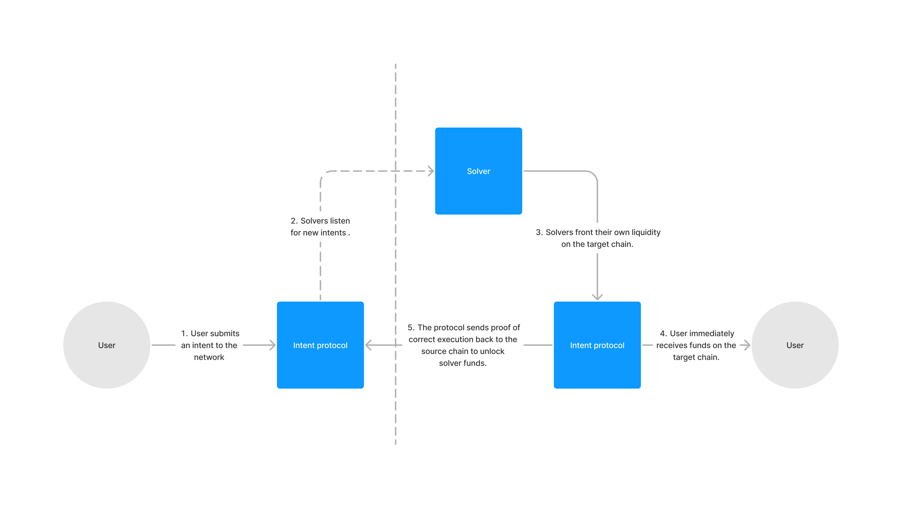
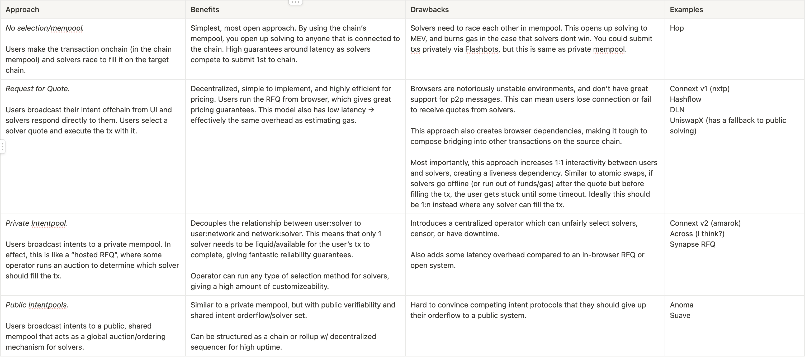
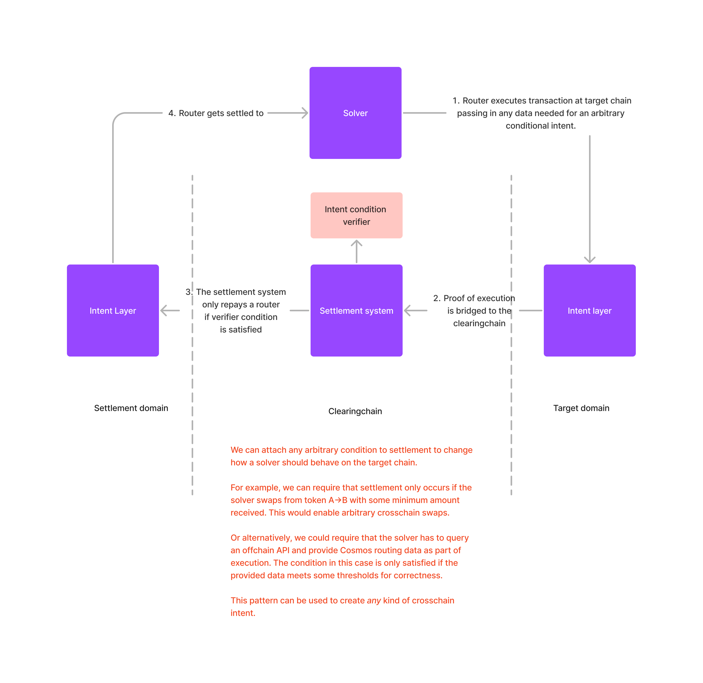

# Background

Everclear is designed to solve problems experienced by participants in cross-domain intent protocols. Before diving into the protocol, let's learn about intents.

## Overview

Intents enable fast, cheap, and generalized transactions across chains. The core principle behind the model is simple: instead of needing to navigate the complexities of path-finding, bridging, switching chains, and paying gas for interchain transactions, users can just pay some service provider to do it on their behalf.

<figure><figcaption>
Architecture of intent based systems.
</figcaption></figure>

Intent systems have three core steps:

1. **Intent Expression**: Users express their intent to do something on another chain (and their willingness to pay fees). Service providers (routers, solvers, fillers, etc.) listen for intents from users.
2. **Intent Execution:** Fillers compete against one another in an auction to fulfill a user’s intent at the best price in some form of auction, with the winning router submitting the user’s transaction to the target chain.
3. **Intent Settlement:** The protocol subsequently repays the winning filler the funds they filled with on the target chain.

In this model, users have their transactions on the target chain completed at the minimum base fee rate that fillers are able to provide.

## Solver Selection

Solver selection is specifically how intent protocols answer the question:

> When a user expresses their intent, how are they matched with a solver to fill it?

There are many approaches to this problem, each with their own set of tradeoffs:

<figure><figcaption>
Comparison of common solver discovery and matching techniques.
</figcaption></figure>

## Generalized Intents

While the majority of conversations around intents are focused on trading, intent-based bridging does not need to be limited to transfers of fungible assets. You can add arbitrary conditionality to solver settlement to get more interesting behavior out of solvers.

<figure><figcaption>
We can further generalize intents by making settlement conditions explicitly programmable.
</figcaption></figure>
