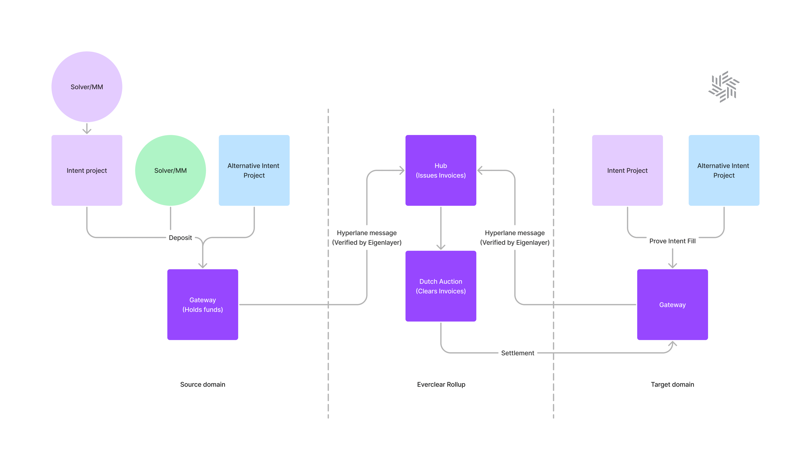

# Architecture

## Overview

<figure><figcaption>
Everclear architecture.
</figcaption></figure>

There are three types of messages related to intents within Everclear:

1. _Intent._ Created when a user generates an intent and dispatched periodically from the source chain to the clearing chain using the transport layer. Contains the source of truth information for the intent data.
2. _Fill. G_enerated when a solver fills an intent and dispatched periodically from the source chain to the clearing chain using the transport layer. Contains information about which solver should be credited in settlement.
3. _Settlement. G_enerated when both the intent and fill messages arrive on the clearing chain. Sent from the clearing chain to the settlement domain, which is where the solver will be repaid for intent execution.

### Flow of Funds

Funds are debited from the caller of `newIntent` and stored on a `Spoke` contract. The virtual balance for this spoke is incremented by the intent amount and can be used to settle solvers of other intents to this domain.&#x20;

Solvers must `deposit` into the `Spoke` contracts. This balance is debited when `fillIntent` is called.&#x20;


`deposit` and `fillIntent` can be executed in the same call by the solver networks. `deposit` can also be called at any point in advance of filling.


Once an intent is filled and the message is added to the `FillQueue`, the solver can be thought of as possessing a claim on any of the available liquidity held on the `Spoke` contracts. Settlement of these claims happens via the `processSettlementQueue` function on the `Hub` contract.


Intent settlement does _not_ have to happen on the same domains associated with the intents, but can happen on any solver-configured spoke domain. \
\
This decouples repayment from intent routing and allows protocol participants to access a global settlement flow across chains.


Once the settlement messages arrive on the spokes, the settlement amounts are debited from the virtual balance held on that spoke and the associated solver has their balance incremented. At any point solvers can withdraw this virtual balance from the contracts or use it to fill new intents initiated from the settlement domain.

## Components

There are several on and off-chain components within this system.

### Contracts

* `Hub`. Handles inbound intent and fill messages on the clearing chain. Dispatches settlement of solver claims via the gateway contract.
* `HubGateway`. Dispatches messages to the transport layer and formats the inbound message payloads to properly call functions on the `Hub`.
* `Auctioneer`. Governs solver selection for routers. Routers compete in a race-to-the bottom auction. Only winning routers are reimbursed for transfers.
* `Spoke`. Holds funds from new intents (used as liquidity for settlement) and solver balances. Formats messages from the `Intent` and `Fill` queues and dispatches them via the `SpokeGateway` contract.
* `SpokeGateway`. Dispatches messages to the transport layer and formats the inbound settlement messages to properly call the functions on `Spoke`.

### Agents

* _Relayers._ These agents are responsible for executing periodic transactions across the network, primarily processing queues. Queues are processed according to configured age and size thresholds per chain.
* _Cartographer._ This agent is responsible for creating a natively cross-chain view of the network state. This view is derived from an indexing layer (i.e. subgraphs) on each chain.
* _Router._ The router is a solver that looks to execute crosschain transactions broadcast throughout the network. These solvers are useful for integrations of crosschain applications without their own solver network.

### Transport Layer

The transport layer is responsible for sending messages throughout the network. The messages are dispatched and processed by the `HubGateway` and `SpokeGateway` contracts. Everclear uses Hyperlane for message transport.
